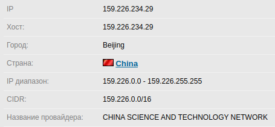

# Задание №1


##  За что отвечает файл [sigs.py](https://github.com/misterch0c/shadowbroker/blob/master/windows/Resources/TeDi/PyScripts/sigs.py)? Зачем он нужен и как может использоваться? Какой группой он мог быть использован? На основании открытых источников составьте список (с ссылками) соотношения сигнатур и известных АПТ-групп.

#### Предыстория
В 2016 году группировка The Shadow Brokers похитила хакерских инструментарий Агентства национальной безопасности США (АНБ). Тогда хакеры объясняли, что ранее эти инструменты принадлежали Equation Group – хакерской группе, которую ИБ-эксперты давно связали с АНБ напрямую. Долгое время хакеры пытались продать похищенную правительственную малварь, но в итоге так и не нашли покупателей. В результате весной 2017 года хакеры решили опубликовать дамп «Трудности перевода» (Lost in Translation) бесплатно, в открытом доступе.

>	Взято из журнала [Хакер](https://xakep.ru/2020/04/23/nazar-apt/)

Среди обнародованных The Shadow Brokers файлов оказался файл [sigs.py](https://github.com/misterch0c/shadowbroker/blob/master/windows/Resources/TeDi/PyScripts/sigs.py).

Считается, что этот файл – это простейший сканер малвари, который операторы АНБ использовали на взломанных компьютерах, чтобы обнаруживать следы активности различных «конкурирующих» хакерских групп. Sigs.py содержит 44 сигнатуры для обнаружения файлов (хакерских утилит), развернутых другими взломщиками. Сигнатуры были пронумерованы от 1 до 45, но номер 42 отсутствовал.


| Signature Number  | Possible APT other name  |
| ----------------- |:------------------------:|
|      SIG1         |    Agent.BTZ (Turla?)    |
|      SIG2         |    Turla        	       |
|      SIG3         |    ShipUp?    	       |
|      SIG4         |	 Snake/Uroburos        |
|      SIG5         |	 Trojan dropper Agent.ikcb Turla tool?		       |
|      SIG6         |	 ?		       |
|      SIG7         |	 GhoTex		       |
|      SIG8         |	 Stuxnet 2 drivers unknown s7otbxdxa.sys s7obxsx.sys	       |
|      SIG9         |	 Flame		       |
|      SIG10        |	 miniFlame   	       |
|      SIG11        |	 ?		       |
|      SIG12        |	 Spuler?	       |
|      SIG13        |	 Agent.BTZ?	       |
|      SIG14        |	 ?		       |
|      SIG15        |	 Turla/Snake/Uroburos  |
|      SIG16        |	 Flame		       |
|      SIG17        |	 SunFlower/ Chesire Cat / Flowershop		       |
|      SIG18        |	 Moonflower/ Chesire Cat / Flowershop (sunflower moonflower)	|
|      SIG19        |	 ?		       |
|      SIG20        |	 Animal Farm	       |
|      SIG21        |	 ?		       |
|      SIG22        |	 Aurora/Hydraq	       |
|      SIG23        |	 Turla (Epic Turla)    |
|      SIG24        |	 ?		       |
|      SIG25        |	 Dark Hotel 	       |
|      SIG26        |	 ?		       |
|      SIG27        |	 ?		       |
|      SIG28        |	 Rotinom	       |
|      SIG29        |	 ?		       |
|      SIG30        |	 Exforel	       |
|      SIG31        |	 ?		       |
|      SIG32        |	 ?		       |
|      SIG33        |	 ?		       |
|      SIG34        |	 ?		       |
|      SIG35        |	 Duqu		       |
|      SIG36        |	 Stuxnet/Duqu?	       |
|      SIG37        |	 Nazar APT	       |
|      SIG38        |	 ?		       |
|      SIG39        |	 Teamspy	       |
|      SIG40        |	 Sednit/Sofacy	       |
|      SIG41        |	 ?		       |
|      SIG42        |	 ?		       |
|      SIG43        |	 Turla		       |
|      SIG44        |	 ?		       |
|      SIG45        |	 ?		       |

> При составлении таблицы использовался [Technical ReportbyLaboratory of Cryptography and System Security](https://www.crysys.hu/publications/files/tedi/ukatemicrysys_territorialdispute.pdf)


##  Умение анализировать код. Нужно найти ключ и описать, как это было сделано?

Я был немного удивлен, когда увидел обфусцированный питоновский скрипт. Но восстановить это бедстие было совсем несложно. Я решил пойти по-порядку
```python
  if __name__ == '__main__':
    O000O000O0OO00000O00()  
```
O000O000O0OO00000O00 - Это имя функции, с помощью Ctr + F ищу тукую же последовательность и переименовываю ее в function_one
```python
  if __name__ == '__main__':
    function_one()
```
Перехожу к function_one, чтобы привести ее к читабельному виду
```python
  def function_one():
    OO0OOOO0OO0OO0OO000O = input('> ')              # Мой ввод сохраняется в некоторую переменную
    if O0O0O0O0OO0O000OOOO0(OO0OOOO0OO0OO0OO000O):  # Вызов функции с переменной, содержащей мой ввод
        print('Ok')
    else:
        print('No')
```
Немного магии и получается следующий читаемый вид
```python
  def function_one():
    my_input = input('> ')
    if function_two(my_input):
        print('Ok')
    else:
        print('No')
```
Перехожу к function_two, действия аналогичны предыдущим
```python
  def function_two(my_input):
    O0O000OOO0OOOOO0OO0O = OO0OOO0OOOOO0000OOO0(my_input)                     # Вызов функции и сохранение возвращаемого значения в переменную
    O00OOO0O0OO0OOOOO000(O0O000OOO0OOOOO0OO0O)    # Вызов функции
    OOO0O0000O0O0O00OO0O(O0O000OOO0OOOOO0OO0O)    # Вызов функции
    OO0O0OO0O00O0000OO0O(O0O000OOO0OOOOO0OO0O)    # Вызов функции
    print(O0O000OOO0OOOOO0OO0O)                   # Вывод переменной
    return O0O00O0OO00OO0O00OO0(O0O000OOO0OOOOO0OO0O, O0O0O00OO0OO0OOOOOO0)   # Вызов функции с двумя параметрами и возврат возвращаемого значения функции
```
Читаемый вариант выгядит так:
```python
  def function_two(my_input):
    result = function_three(my_input)
    function_four(result)
    function_five(result)
    function_six(result)
    print(result)
    return function_seven(result, two_array)
```
####  Листинг кода
```python
two_array = [
    [2106, -7516, 764, -4620, -8448, 7794, -8047, 5554],
    [3617, 5156, -700, -9005, -8527, -1123, -3721, 9422],
    [-82, -8959, -7452, 4810, 3331, 5148, -2218, -6985],
    [-7087, 3842, -9310, -3049, -8457, 5378, 6376, 2405],
    [-5082, -5196, 4239, -1167, -7170, -9237, -7335, 7224],
    [631, -6429, 736, 1769, 3891, 6355, -1082, -2624],
    [326, 9142, 894, 5149, -3627, 8222, 7043, 9555],
    [-4432, -118, 3357, -1005, -6215, -4896, -686, -6897]]

def function_three(my_input):
    x = 1
    while x * x < len(my_input):
        x += 1
    result = [[0 for i in range(x)] for j in range(x)]  # Создание двумерного массива x * x
    for i, j in enumerate(my_input):                 
        result[i // x][i % x] = ord(j)                  # Заполнение двумерного массива аски кодом символов из введенной строки 
    for i in range(len(my_input), x*x):
        result[i // x][i % x] = -i                      # Заполнение остатка отрицательным счетчиком 
    return result


def function_four(result):
    for i in result:                                    # Перемещение сосдених индексов, начания с первых отрицательных чисел
        for j in range(0, len(i), 2):
            i[j], i[j+1] = i[j+1], i[j]
    for j in range(len(result[0])):                     # Перемещение измененных элементов к первоначальному состоянию
        for z in range(0, len(result), 2):
            result[j][z], result[j][z + 1] = result[j][z+1], result[j][z]


def function_five(result):
    for i in range(len(result)):
        for j in range(len(result[0])):
            result[i][j] += result[0][j]


def function_six(result):
    import random
    random.seed(753)
    for i in result:
        for j in range(len(i)):
            i[j] += random.randrange(-10000, 10000)     # Прибавление псевдослучайного числа, причем последовательность всегда одинаковая


def function_seven(result, two_array):
    if len(result) != len(two_array) or len(result[0]) != len(two_array[0]):  # Сравнение длин двумерных массивов и длин одномерных массивов под индексом 0
        return False
    return all(all(i == j for i, j in zip(x, y)) for x, y in zip(result, two_array))  # Поэлементное сравнение двумерных массивов


def function_two(my_input):
    result = function_three(my_input)   # Создание и инициализация двумерного массива
    function_four(result)               # Функция не изменяет двумерный массив
    function_five(result)               # Поэлементное сложение всех одномерных массивов с одномерным масивов под индексом 0
    function_six(result)                # Прибавление к каждому элементу псевдослучайной последовательности с одинаковым зерном
    print(result)                       # Вывод двумерного массива
    return function_seven(result, two_array)  # Сравнение result и two_array. Если они равны, возвращение True, иначе False


def function_one():
    my_input = input('> ')        # Считывается мой ввод
    if function_two(my_input):
        print('Ok')
    else:
        print('No')


if __name__ == '__main__':
    function_one()
```
#### Первый способ нахождения ключа - Брут!
Можно последовательно прокучивать символы до тех пор, пока значения определенных индексов в двумерном массива не совпадут. Как только они совпали - символ найден, сохраняем его и переходим к следующему.

Для этого я написал не слишком автоматизированный bash скрипт, который прокручивает ascii символы и выводит этот символ, если он совпал с одним из индексов двумерного массива, объявленного в программе.
```bash
  for ((i=32; i <127; i++))
  do
	  X=`echo "obase=16; $i" | bc`
	  echo -e "\x$X"aaaaaaaaaaaaaaaaaaaaaaaaaaaaaaaaaaaaaaaaaaaaaaaaaaa | python3 a.py | grep '2106' && echo -e "\x$X"
  done
```
X=`echo "obase=16; $i" | bc` - перевод десятичного числа в шестнадцатеричное
echo -e "\x$X" - вывод подбираемого символа в виде ascii символа
echo -e "\x$X"aaaaaaaaaaaaaaaaaaaaaaaaaaaaaaaaaaaaaaaaaaaaaaaaaaa - предполагаемая длина ключа, рассчитывается либо экспериментально (от разной длинны ввода разная длина двумерного массива), либо анализируя function_three (первый цикл while) 

Скрипт выводит букву L - это первый символ нашего флага
Чтобы начать перебирать следующий символ, нужно поработать немного ручками:
  1.  Сдвигаем символ, который перебираем **echo -e "\x$X"aaaaaaaaaaaaaaaaaaaaaaaaaaaaaaaaaaaaaaaaaaaaaaaaaaa** -> **echo -e "L\x$X"aaaaaaaaaaaaaaaaaaaaaaaaaaaaaaaaaaaaaaaaaaaaaaaaaa**
      Удаляем одну букву a и перед \x$X записываем подобранный сивол
  2.  Изменяем контрольное значение двумерного массива на следующее **grep '2106'** -> **grep '\-7516'** Обратный слеш использую для экранирования -, можно писать и без - 

Всего лишь пару минут ручками и флаг готов: KL{d0_y0u_kn0w_wh47_71m3_15_17?_71m3_70_b3c0m3_6r347_1n73rn!}

#### Второй способ нахождения ключа - Воспроизведение действий над двумерным массивом в обратном порядке
Чтобы высчитать изначально введенное число нужно:

	1.	Вычитание псевдослучайного числа из конечного числа
	
	2.	Для одномерного массива под индексом 0 деление элемента на два, для остальных элементов вычитание соответствующего элемента из одномерного массива под индексом 0

Итак, с зерном равным 753 всегда будет генерироваться следующая последовательность 1956, -7668, 518, -4820...

Наш первый элемент двумерного массива равен 2106, если я из этого числа вычту 1956, то получу:
2106 - 1956 = 150

Следующее мое действие - это деление 150 на 2:
150 / 2 = 75
А вот и ASCII код ключа 75 = **K**

Повторю эти же действия для следующих двух элементов

-7516 - (-7668) = 152
152 / 2 = 76
76 = **L**


764 - 518 = 246
246 / 2 = 123
123 = **{**

Получается такая последовательно KL{, совпадающая с началом ключа, вычисленного в первом варианте.

Ответ:	KL{d0_y0u_kn0w_wh47_71m3_15_17?_71m3_70_b3c0m3_6r347_1n73rn!}


##  В какой атаке засветился IP 159.226.234.29?

Где же засветился этот IP адрес? Первое что я сделал - это посмотрел информацию об этом IP адресе с помощью сервиса [2ip](https://2ip.ru/whois/).



Хм, Китай, да к тому же провайдер - Китайская Научно-Техническая сеть.
> Мой интерес подогревается.

Затем я пошел в Гугл, и он меня не разочаровал:

  [11+ суперкомпьютеров было взломано криптомайнерами](https://securityboulevard.com/2020/05/11-plus-supercomputers-hacked-with-cryptominers-by-china/)
  
  [Вредоносные крипто-майнеры ставят под угрозу академические центры обработки данных](https://cloudsek.com/threatintelligence/malicious-crypto-miners-compromise-academic-data-centers/)
  
  [Просмотр недавних атак на суперкомпьютерные системы с точки зрения анализа угроз](https://www.freebuf.com/vuls/237119.html)
  
Отсюда делаю вывод, что данный IP - сервер Китайской Научно-Технической сети.

Этот IP был жертвой в недавнем инциденте, связанном со взломом суперкопьютеров. Источники утверждают, что злоумышленники подключались к серверу с помощью SSH, используя скомпрометированные данные. Злоумышленники установили вредоносное ПО для майнинга криптовалюты Monero и использовали различные методы, чтобы скрыть активность, включая вредоносный модуль ядра Linux. Было замечено, что основная вредоносная активность происходит в ночное время, чтобы исбежать обнаружения. Также был оставлен бэкдор в качестве SUID программы.

В данном инциденте пострадало больше одиннадцати суперкомпьютеров, в разных странах.

Сейчас скомпрометированные суперкомпьтеры отключены от внешней сети, и будут отключены до тех пор, пока безопасность не будет восстановлена.
