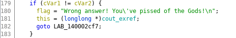
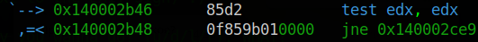

В данном задании мне дается два файла gold_digger - исполняемый файл для Windows и текстовый файл maze.txt, как предполагалось мной, содержит действительную карту для игры
> Спойлер - карта другая

Первым делом я посмотрел строки, которые есть в исполняемом файле:  **strings gold_digger**. Из интересного, нашел вот такую запись
```
Congratz, you've reached the exit!
That's you flag, if you obeyed the Gods:
```
Значит мне нужно победить, чтобы получить мой флаг.


Т.к. я еще не переключился с Linux системы, я продолжил анализирвоать файл в ней, работающая программа выглядит премерно следующим образом

```
Which way you wanna go? (u/d/l/r): l
Solve the puzzle to praise the Gods and make a move: md5(?) = da 2e 6f 3a 77 17 c5 78 d6 6e d6 cb 37 bf 0b 79 
Answer: WHAT?
Wrong answer! You've pissed of the Gods!
```
Позапускав еще несколько раз, я заметил, что md5 хэш каждый раз отличается. Подбирать захэшированное слово совсем не хочется, поэтому первая мысль, которая у меня возникла: "А давай-ка я изменю условие проверки, чтобы оно всегда было ложным и я мог свободно перемещаться"

Для этого я открыл ghidra, нашел условие сравнения моего ввода и значения



А вот и ассемблерный код этого сравнения



Дальше все просто, изменяем ассембленую инструкцию **jne 0x140002ce9** на **je 0x140002ce9**. Теперь мы выйдем из программы только тогда, когда введем правильное захешированное слово, а в этом я очень сомневаюсь.


