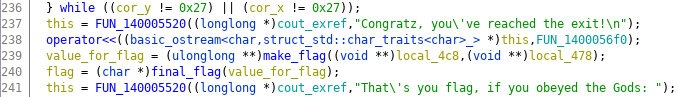
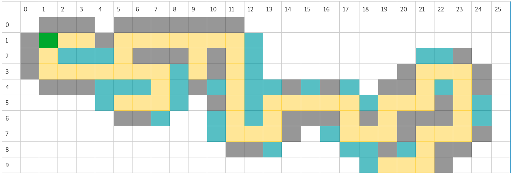

В данном задании мне дается два файла gold_digger - исполняемый файл для Windows и текстовый файл maze.txt, как предполагалось мной, содержит действительную карту для игры
> Спойлер - карта другая

Первым делом я посмотрел строки, которые есть в исполняемом файле:  **strings gold_digger**. Из интересного, нашел вот такую запись
```
Congratz, you've reached the exit!
That's you flag, if you obeyed the Gods:
```
Значит мне нужно победить, чтобы получить мой флаг.


Т.к. я еще не переключился с Linux системы, я продолжил анализирвоать файл в ней, работающая программа выглядит премерно следующим образом

```
Which way you wanna go? (u/d/l/r): l
Solve the puzzle to praise the Gods and make a move: md5(?) = da 2e 6f 3a 77 17 c5 78 d6 6e d6 cb 37 bf 0b 79 
Answer: WHAT?
Wrong answer! You've pissed of the Gods!
```
Позапускав еще несколько раз, я заметил, что md5 хэш каждый раз отличается. Подбирать захэшированное слово совсем не хочется, поэтому первая мысль, которая у меня возникла: "А давай-ка я изменю условие проверки, чтобы оно всегда было ложным и я мог свободно перемещаться"

Для этого я открыл ghidra, нашел условие сравнения моего ввода и значения


А вот и ассемблерный код этого сравнения


Дальше все просто, изменяем ассембленую инструкцию **jne 0x140002ce9** на **je 0x140002ce9**. Теперь мы выйдем из программы только тогда, когда введем правильное захешированное слово, а в этом я очень сомневаюсь.

Говоря о флаге, в цикле действий мы бегаем до тех пор, пока координаты по x и y не будут равны 0x27 = 39. После чего выводится поздравление и начинается подготовка флага. Под подготовкой я имею ввиду создание некоторого значения для флага, а затем и создание самого флага, на основании этого значения.

> Вид флага зависит от количество шагов. Как сказано в подсказке, нужен кратчайший путь.



Т.к. я уже могу свободно перемещаться по лабиринту, я начал его изучать играя. Было досадно, когда я заметил, что они отличается от лабиринта в файле maze.txt, но т.к. этот файл участвует в программе я дулаю предположение, что во время считывания он как-то видоизменяется, ну, не страшно.

Мне было интересно нарисовать карту, да и игра в целом забавная. Я написал скрипт, который автоматически проверят ближайшие четыре клетки на наличие препятствий

```bash
  a=""                        

  echo -e "$a""u\n1\n1" | wine ./test | tail -n 3 > file
  echo -n "UP     ->      "
  cat file | grep -o "wall"
  cat file | grep -o "bomb"       
  cat file | grep -o "step"

  echo -e "$a""d\n1\n1" | wine ./test | tail -n 3 > file
  echo -n "DOWN   ->      "
  cat file | grep -o "wall"
  cat file | grep -o "bomb"       
  cat file | grep -o "step"

  echo -e "$a""l\n1\n1" | wine ./test | tail -n 3 > file
  echo -n "LEFT   ->      " 
  cat file | grep -o "wall"
  cat file | grep -o "bomb"       
  cat file | grep -o "step"

  echo -e "$a""r\n1\n1" | wine ./test | tail -n 3 > file
  echo -ne "RIGHT ->      " 
  cat file | grep -v "direction" | tail -n 2 | grep -o "wall"      
  cat file | tail -n 1 | grep -o "bomb"
  cat file | grep -v "direction" | tail -n 2 | grep -o "step"
```

Я все еще сидел на Linux системе, поэтому для запуска программы мне приходилось использовать wine.

Переменная **a** является моей текущей точкой, она соединяется с действием, например, шаг вверх **u\n1\n1**. Почему именно так: программа за одну итерацию требует два ввода, первый ввод - направление шага, второй ввод - ответ на загадку, единица здесь является случайным ответом. После этого я отправляю программе 1 в качетсве дейсвия, она получает неверное действие и завершается, иначе уходит в бесконечный цикл.

Например, для начального положения я получил такой вывод
```
  UP	  ->      wall
  DOWN	->      step
  LEFT	->      wall
  RIGHT	->      step
```
Теперь я хочу прогнать скрипт, опустившиcь на шаг вниз. Для этого я изменяю значение переменной **a** на **a="d\n1\n"**

Соответственно получаю
```
  UP	  ->	    step
  DOWN	->      step
  LEFT	->      wall
  RIGHT	->      bomb
```

Продолжая прогонать программу и увеличая **a**, у меня стала получаться такая карта



Финальный запуск игры для пропатченного gold_digger выглядит так
```
  echo -e 'd\x0a1\x0ad\x0a1\x0ar\x0a1\x0ar\x0a1\x0ar\x0a1\x0ar\x0a1\x0au\x0a1\x0au\x0a1\x0ar\x0a1\x0ar\x0a1\x0ar\x0a1\x0ar\x0a1\x0ar\x0a1\x0ar\x0a1\x0ad\x0a1\x0ad\x0a1\x0ad\x0a1\x0ad\x0a1\x0ad\x0a1\x0ad\x0a1\x0ar\x0a1\x0ar\x0a1\x0au\x0a1\x0au\x0a1\x0ar\x0a1\x0ar\x0a1\x0ar\x0a1\x0ar\x0a1\x0ad\x0a1\x0ad\x0a1\x0ar\x0a1\x0ar\x0a1\x0au\x0a1\x0au\x0a1\x0ar\x0a1\x0ar\x0a1\x0au\x0a1\x0au\x0a1\x0ar\x0a1\x0ar\x0a1\x0ad\x0a1\x0ad\x0a1\x0ad\x0a1\x0ad\x0a1\x0al\x0a1\x0al\x0a1\x0ad\x0a1\x0ad\x0a1\x0al\x0a1\x0al\x0a1\x0ad\x0a1\x0ad\x0a1\x0ar\x0a1\x0ar\x0a1\x0ar\x0a1\x0ar\x0a1\x0ar\x0a1\x0ar\x0a1\x0ad\x0a1\x0ad\x0a1\x0ar\x0a1\x0ar\x0a1\x0ar\x0a1\x0ar\x0a1\x0au\x0a1\x0au\x0a1\x0ar\x0a1\x0ar\x0a1\x0ad\x0a1\x0ad\x0a1\x0ad\x0a1\x0ad\x0a1\x0ar\x0a1\x0ar\x0a1\x0ad\x0a1\x0ad\x0a1\x0ar\x0a1\x0ar\x0a1\x0ar\x0a1\x0ar\x0a1\x0au\x0a1\x0au\x0a1\x0ar\x0a1\x0ar\x0a1\x0ad\x0a1\x0ad\x0a1\x0ad\x0a1\x0ad\x0a1\x0al\x0a1\x0al\x0a1\x0ad\x0a1\x0ad\x0a1\x0ar\x0a1\x0ar\x0a1\x0ad\x0a1\x0ad\x0a1\x0al\x0a1\x0al\x0a1\x0al\x0a1\x0al\x0a1\x0al\x0a1\x0al\x0a1\x0ad\x0a1\x0ad\x0a1\x0ar\x0a1\x0ar\x0a1\x0ar\x0a1\x0ar\x0a1\x0ad\x0a1\x0ad\x0a1\x0ar\x0a1\x0ar\x0a1\x0ad\x0a1\x0ad\x0a1\x0ad\x0a1\x0ad\x0a1\x0al\x0a1\x0al\x0a1\x0ad\x0a1\x0ad\x0a1\x0al\x0a1\x0al\x0a1\x0au\x0a1\x0au\x0a1\x0al\x0a1\x0al\x0a1\x0ad\x0a1\x0ad\x0a1\x0al\x0a1\x0al\x0a1\x0au\x0a1\x0au\x0a1\x0au\x0a1\x0au\x0a1\x0au\x0a1\x0au\x0a1\x0au\x0a1\x0au\x0a1\x0au\x0a1\x0au\x0a1\x0au\x0a1\x0au\x0a1\x0ar\x0a1\x0ar\x0a1\x0au\x0a1\x0au\x0a1\x0al\x0a1\x0al\x0a1\x0au\x0a1\x0au\x0a1\x0al\x0a1\x0al\x0a1\x0au\x0a1\x0au\x0a1\x0al\x0a1\x0al\x0a1\x0al\x0a1\x0al\x0a1\x0al\x0a1\x0al\x0a1\x0ad\x0a1\x0ad\x0a1\x0al\x0a1\x0al\x0a1\x0ad\x0a1\x0ad\x0a1\x0ar\x0a1\x0ar\x0a1\x0ad\x0a1\x0ad\x0a1\x0ad\x0a1\x0ad\x0a1\x0ar\x0a1\x0ar\x0a1\x0ad\x0a1\x0ad\x0a1\x0al\x0a1\x0al\x0a1\x0ad\x0a1\x0ad\x0a1\x0ad\x0a1\x0ad\x0a1\x0al\x0a1\x0al\x0a1\x0au\x0a1\x0au\x0a1\x0al\x0a1\x0al\x0a1\x0al\x0a1\x0al\x0a1\x0al\x0a1\x0al\x0a1\x0au\x0a1\x0au\x0a1\x0ar\x0a1\x0ar\x0a1\x0au\x0a1\x0au\x0a1\x0al\x0a1\x0al\x0a1\x0al\x0a1\x0al\x0a1\x0au\x0a1\x0au\x0a1\x0ar\x0a1\x0ar\x0a1\x0ar\x0a1\x0ar\x0a1\x0au\x0a1\x0au\x0a1\x0al\x0a1\x0al\x0a1\x0al\x0a1\x0al\x0a1\x0au\x0a1\x0au\x0a1\x0au\x0a1\x0au\x0a1\x0al\x0a1\x0al\x0a1\x0ad\x0a1\x0ad\x0a1\x0ad\x0a1\x0ad\x0a1\x0al\x0a1\x0al\x0a1\x0au\x0a1\x0au\x0a1\x0au\x0a1\x0au\x0a1\x0au\x0a1\x0au\x0a1\x0al\x0a1\x0al\x0a1\x0ad\x0a1\x0ad\x0a1\x0al\x0a1\x0al\x0a1\x0al\x0a1\x0al\x0a1\x0ad\x0a1\x0ad\x0a1\x0ad\x0a1\x0ad\x0a1\x0ar\x0a1\x0ar\x0a1\x0au\x0a1\x0au\x0a1\x0ar\x0a1\x0ar\x0a1\x0ad\x0a1\x0ad\x0a1\x0ad\x0a1\x0ad\x0a1\x0al\x0a1\x0al\x0a1\x0al\x0a1\x0al\x0a1\x0al\x0a1\x0al\x0a1\x0ad\x0a1\x0ad\x0a1\x0ad\x0a1\x0ad\x0a1\x0ar\x0a1\x0ar\x0a1\x0ad\x0a1\x0ad\x0a1\x0al\x0a1\x0al\x0a1\x0ad\x0a1\x0ad\x0a1\x0ad\x0a1\x0ad\x0a1\x0ar\x0a1\x0ar\x0a1\x0au\x0a1\x0au\x0a1\x0ar\x0a1\x0ar\x0a1\x0ad\x0a1\x0ad\x0a1\x0ad\x0a1\x0ad\x0a1\x0al\x0a1\x0al\x0a1\x0al\x0a1\x0al\x0a1\x0ad\x0a1\x0ad\x0a1\x0ad\x0a1\x0ad\x0a1\x0ar\x0a1\x0ar\x0a1\x0ad\x0a1\x0ad\x0a1\x0ar\x0a1\x0ar\x0a1\x0au\x0a1\x0au\x0a1\x0au\x0a1\x0au\x0a1\x0ar\x0a1\x0ar\x0a1\x0au\x0a1\x0au\x0a1\x0ar\x0a1\x0ar\x0a1\x0ad\x0a1\x0ad\x0a1\x0ad\x0a1\x0ad\x0a1\x0al\x0a1\x0al\x0a1\x0ad\x0a1\x0ad\x0a1\x0ar\x0a1\x0ar\x0a1\x0ar\x0a1\x0ar\x0a1\x0ar\x0a1\x0ar\x0a1\x0au\x0a1\x0au\x0a1\x0ar\x0a1\x0ar\x0a1\x0au\x0a1\x0au\x0a1\x0au\x0a1\x0au\x0a1\x0au\x0a1\x0au\x0a1\x0au\x0a1\x0au\x0a1\x0ar\x0a1\x0ar\x0a1\x0ar\x0a1\x0ar\x0a1\x0ad\x0a1\x0ad\x0a1\x0ar\x0a1\x0ar\x0a1\x0ad\x0a1\x0ad\x0a1\x0ar\x0a1\x0ar\x0a1\x0ar\x0a1\x0ar\x0a1\x0ar\x0a1\x0ar\x0a1\x0ad\x0a1\x0ad\x0a1\x0al\x0a1\x0al\x0a1\x0al\x0a1\x0al\x0a1\x0al\x0a1\x0al\x0a1\x0ad\x0a1\x0ad\x0a1\x0ad\x0a1\x0ad\x0a1\x0ar\x0a1\x0ar\x0a1\x0ar\x0a1\x0ar\x0a1\x0ar\x0a1\x0ar\x0a1\x0ar\x0a1\x0ar\x0a1\x0au\x0a1\x0au\x0a1\x0au\x0a1\x0au\x0a1\x0ar\x0a1\x0ar\x0a1\x0ar\x0a1\x0ar\x0a1\x0ad\x0a1\x0ad\x0a1\x0ar\x0a1\x0ar\x0a1\x0ar\x0a1\x0ar\x0a1\x0ad\x0a1\x0ad\x0a1\x0ar\x0a1\x0ar\x0a1\x0a' | wine ./gold_digger 
```

Ответ:  flg:SAS2019_7h47w45r34l4dv3n7ur3

> Исходничек бы глянуть :)
